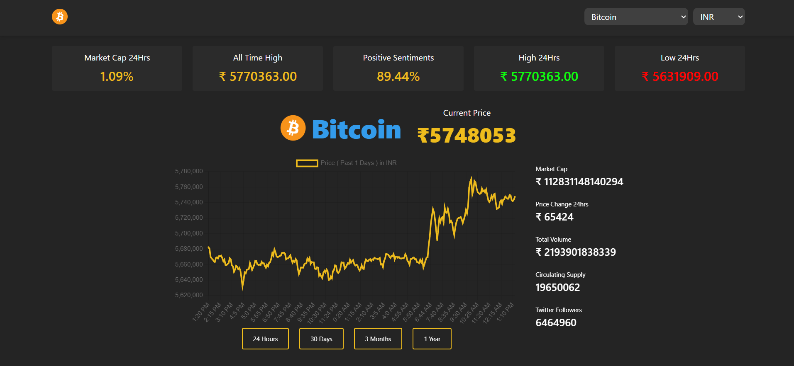

# Real-timeStock/CryptoDashboard

- Site Url :- (https://real-time-stock-crypto-dashboard.netlify.app/)

## Description

A real time stock and crypto dashboard application built using React.js

## Landing Page

## Dashboard Features:-

A selection of stocks or cryptocurrencies along with their current prices and percentage changes.
Interactive charts or graphs to visualise historical price trends for each stock or cryptocurrency.

## Edge Case :-

- Avoid multiple api calls because api has limited refresh rate.

### TechStack used :-

- React.js
- Css
- Javascript
- chart.js
- axios
- react-chartjs-2
- Chakra-ui
